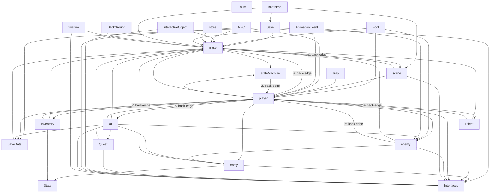

# RPG Dungeon — Package Dependency Reference
**Cập nhật:** 2026-06-28 | **Engine:** Unity URP | **Platform:** Mobile Android/iOS

---

## 1. Layer Model (Intended)

```
L0  Foundation   Base · Interfaces · stateMachine · Enum(global)
L1  Data         SaveData · Stats
L2  Save         Save
L3  Domain       entity · Effect · Inventory
L4  Core         player · enemy
L5  Systems      Pool · scene · Quest
L6  World        InteractiveObject · Trap · NPC · store
L7  Presentation UI · AnimationEvent
L8  Composition  Bootstrap · System · BackGround · Sound
```

> Quy tắc: mọi cạnh phụ thuộc phải đi **xuống** (số layer cao → số layer thấp).  
> Cạnh đi ngược chiều = **back-edge** = vi phạm.

---

## 2. Package Catalog

| Package (folder) | Namespace | Trách nhiệm chính | Types tiêu biểu |
|---|---|---|---|
| `Base/` | `Base` | Core utils, EventBus, ServiceLocator, ObjectPool | `EventBus<T>`, `EventBinding<T>`, `IEvent`, `ServiceLocator`, `ObjectPool<T>`, `GameBootstrapper`, `GameEvents` |
| `Interfaces/` | `Interfaces` | Cross-cutting contracts | `IHit`, `IHitVFX`, `ICollectable`, `IInteractable`, `ICounterable`, `IScenePersistable`, `ITreeNodePersistent`, `ISaveService`, `ISkillTreeState` |
| `StateMachine/` | `stateMachine` | Generic FSM | `StateMachine`, `EntityState` |
| `Enum/` | _(global)_ | Shared enums | `ElementType`, `ItemTypes`, `EquipSlotType`, `EnemyType`, `SkillType`, `ButtonSkillName` |
| `Stats/` | `Stats` | Stat ScriptableObjects | `Stat`, `MajorStats`, `OffensiveStats`, `DefensiveStats`, `StatType` |
| `SaveData/` | `SaveData` | Pure DTO structs + restore events | `PlayerSaveData`, `ItemSaveEntry`, `EquipSaveEntry`, `NodeSaveEntry`, `SceneStateData`, `QuestProgressEntry`, `SkillTreeSaveData`, `SkillTreeRestoreEvent` |
| `Save/` | `Save` | Persistence orchestration (IO only) | `SaveManager`, `SaveBootstrapper`, `IIPlayerPersistent` (global ns) |
| `Entity/` | _(global)_ | Shared entity base | `Entity`, `EntityStat`, `EntityHealth`, `EntityCombat`, `EntityVfx`, `EntityStatusHandler`, `IItemEffectTarget` |
| `Effect/` | _(global)_ | VFX + item effect data | `AfterImageEffect`, `HitEffect`, `PoolableVfx`, `SliceEffect`, `ItemEffectData`, `ItemEffectIceData`, `ItemEffectDracula` |
| `Inventory/` | _(global)_ | Items, loot, equipment | `InventoryBase`, `PlayerInventory`, `ItemInventory`, `ItemData`, `EquipmentData`, `ItemListData`, `EntityDrop`, `ItemDataRegistry` |
| `Enemies/` | `enemy` | Enemies + AI states | `Enemy`, `EnemySkeleton`, `EnemySlime`, `EnemyDeathRippler`, `EnemyHealth`, `EnemyVfx`, enemy states, `EnemyData`, `EnemyEvents` |
| `Player/` | `player` | Player character, skills, persistence | `Player`, `PlayerHealth`, `PlayerLevel`, `PlayerCombat`, `PlayerInventory`, `PlayerPersistent`, player states, `SkillBase`, skill objects, `PlayerEvents` |
| `Pool/` | _(global)_ | Object pools | `PoolManager`, `EnemyPool`, `ItemPickablePool`, `HitEffectPool`, `DamagePopupPool`, `LevelUpEffectPool`, `ArcherArrowPool` |
| `Scene/` | `scene` | Scene flow, portals, checkpoints | `SceneTransitionManager`, `SceneEntityManager`, `Portal`, `CheckPoint`, `CameraZoneTrigger` |
| `Quest/` | `Quest` | Quest definitions + tracking | `QuestData`, `KillQuestData`, `RescueNpcQuestData`, `Scavahunt`, `SceneQuestController`, `QuestEvents` |
| `InteractiveObject/` | _(global)_ | World pickups & chests | `ItemObjectPickable`, `ObjectChestBase`, `ObjectChestDropItem` |
| `Trap/` | _(global)_ | Hazards | `BearTrap` |
| `NPC/` | `NPC` | Non-player characters | `Npc`, `RescuableNpc`, `NPCShop`, `NpcMerchant` |
| `Store/` | _(global)_ | Merchant / crafting | `Store`, `ItemCraft` |
| `UI/` | `UI` / _(global)_ | All HUD + menus | `UIManager`, `UISkillTree`, `UITreeNode`, `UIConnectedHandler`, `UI_Inventory`, `UILevelUpPanel`, `UIMainMenu`, `UIStatPanel`, `UI_StoreMerchant` |
| `AnimationEvent/` | _(global)_ | Animator → gameplay glue | `EntityAnimationEvent`, `PlayerAnimationEvent`, `EnemyAnimationEvent`, `SkillAnimationEvent` |
| `System/` | `System` | Game lifecycle | `GameManager`, `GameMessages`, `MyMenu` |
| `BackGround/` | _(global)_ | Parallax | `ParrallexBG`, `ParrallexController` |
| `Sound/` | _(global)_ | Audio | `SoundManager` |

---

## 3. Dependency Graph — Thực tế hiện tại

### Mermaid Diagram



---

## 4. Bảng dependencies (để check khi vẽ)

| Package | Phụ thuộc CLEAN ✓ | Phụ thuộc BACK-EDGE ⚠️ |
|---|---|---|
| `Base` | `stateMachine` | `player` (CameraResolutionFitter), `scene` (CameraResolutionFitter) |
| `stateMachine` | — | `player` (StateMachine.cs) |
| `Interfaces` | — | — |
| `Enum` | — | — |
| `Stats` | — | — |
| `SaveData` | `Base` | — |
| `Save` | `Base`, `Interfaces`, `SaveData` | — ✅ |
| `entity` | `Base`, `Interfaces`, `Stats` | — |
| `Effect` | `Base`, `Interfaces` | `player` (ItemEffectData/Dracula/Ice) |
| `Inventory` | `Base`, `Stats` | `player` (PlayerInventory, ItemInventory) |
| `enemy` | `Base`, `Interfaces`, `entity` | `player` (EnemyDeathRippler boss) |
| `player` | `Base`, `Interfaces`, `stateMachine`, `SaveData`, `entity`, `enemy`, `Inventory`, `Effect` | `UI` (Player.cs) |
| `Pool` | `Base`, `player`, `enemy` | — |
| `scene` | `Base`, `Interfaces`, `player` | — |
| `Quest` | `Base`, `Interfaces` | — |
| `InteractiveObject` | `Base`, `Interfaces` | — |
| `Trap` | `player` | — |
| `NPC` | `Base`, `Interfaces`, `player` | — |
| `store` | `Base` | — |
| `UI` | `Base`, `Interfaces`, `entity`, `player`, `enemy`, `Quest`, `SaveData` | — |
| `AnimationEvent` | `Base`, `player`, `enemy` | — |
| `System` | `Base`, `Interfaces` | — |
| `BackGround` | `Base` | — |
| `Sound` | — | — |

---

## 5. Back-edges còn lại (sau session 2026-06-28)

| # | Back-edge | Vị trí | Cách fix dự kiến |
|---|---|---|---|
| 1 | `Base → player` | `CameraResolutionFitter.cs` | Di chuyển file sang `scene/` hoặc `player/` |
| 2 | `Base → scene` | `CameraResolutionFitter.cs` | Cùng với #1 |
| 3 | `stateMachine → player` | `StateMachine.cs` | Xem xét nội dung — có thể chỉ là stale using |
| 4 | `Effect → player` | `ItemEffectData.cs`, `ItemEffectIceData.cs`, `ItemEffectDracula.cs` | DIP qua `IItemEffectTarget` (đã có trong `entity`) — cần migrate |
| 5 | `Inventory → player` | `PlayerInventory.cs`, `ItemInventory.cs` | DIP qua `IItemEffectTarget` — cùng fix với #4 |
| 6 | `enemy → player` | `EnemyDeathRippler.cs` | EventBus hoặc interface `IPlayerTarget` |
| 7 | `player → UI` | `Player.cs` | EventBus để open UI thay vì gọi UIManager trực tiếp |

---

## 6. Cycles đã được phá (completed)

| Cycle | Technique |
|---|---|
| `player ↔ Effect` (ElectricEffect) | Parameter injection — spawner truyền `float damage` |
| `Inventory ↔ Pool` | EventBus — `DropItemRequestedEvent` |
| `entity ↔ Inventory` | Relocate `EntityDrop` → Inventory; event-driven spawn |
| `Inventory ↔ player` (loot/effect target) | `IItemEffectTarget` ở `entity` layer |
| `player ↔ UI` (SkillTree reset) | EventBus `SkillTreeResetEvent`; `ISkillTreeState` ở Interfaces |
| `Save → player` | `IIPlayerPersistent.RestoreFromSaveData()` — SaveManager delegate xuống interface, không reference Player types |

---

## 7. Intentional Globals (không namespace)

| Type | Lý do không đặt namespace |
|---|---|
| `Enum/` (7 enums) | Pure leaf — `namespace Enum` clash với `System.Enum` |
| `EntityAnimationEvent` | Shared base cho player + enemy anim events — tránh `player→enemy` cycle |
| `GameManager` | Root service qua ServiceLocator — tránh lan rộng `namespace System` bug |
| `entity` package types | Folder `Entity/` collision với class `Entity` — dùng global để tránh nhập nhằng |
